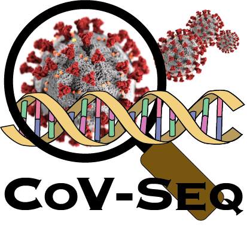

# CoV-Seq: COVID-19 Genomic Sequence Database and Visualization

<div style="text-align:center"></div>

## 1. Clone the repository
git clone https://github.com/boxiangliu/covseq.git

CoV-Seq is written and tested in `python 3.7`, and should in theory work with any `python 3` versions. CoV-Seq is not compatible with `python 2`.

CoV-Seq has been tested on Ubuntu 18.04.4, macOS Catalina, and Windows 10.

NOTE: if you are using Windows, please refer to `README_win_os.md` for more instructions before proceeding.


## 2. Preliminaries 

### 2.1 Shell dependencies
For Linux and Mac users, you will need to install `bcftools` and `htslib` by following instructions [here](http://www.htslib.org/download/). 

For Windows users, please refer to `README_win_os.md` for more instructions about dependencies.


### 2.2 Python modules
You will also need to install the following Python packages:
```
click
biopython
hashlib
pandas [>=1.0.3]
matplotlib
seaborn
dateutil
werkzeug
```


## 3. Quick Start

We have made CoV-Seq very easy to use. To annotate a SARS-CoV-2 genome in FASTA format, go to the `covseq` directory and run: 

```
python annotation/annotation.py --fasta data/GZ8H0001.fasta --out_dir results
```

NOTE: Replace `data/GZ8H0001.fasta` with your fasta file and `results` with your desired output directory. 

If the command was successful, there should 4 files in the `results/` directory.

```
Guangzhou_GZ8H0001_2020_orf.tsv
Guangzhou_GZ8H0001_2020.vcf
Guangzhou_GZ8H0001_2020.snpEff.vcf
Guangzhou_GZ8H0001_2020.snpEff.tsv
```

The filename `Guangzhou_GZ8H0001_2020` comes from the FASTA header in `data/GZ8H0001.fasta`. Notice that characters "/" have been automatically replaced with "\_" to save us from using escape characters. Here is a description of each file:

1. \*\_orf.tsv: ORF predictions.
2. \*.vcf: variant calls
3. \*.snpEff.vcf: variant calls annotated with snpEff
4. \*.snpEff.tsv: parsed VCF annotations


**That's it**. You can now use the VCF and annotations for downstream analysis. 

For all options, run 

```
annotation/annotation.py --help
```

## 4. Batch processing

The following section describes the pipeline we used to batch process tens of thousands of FASTA sequences available for download on `covseq.baidu.com/browse`.


### 4.1 Download genomic data and metadata

The first step is to download data from repositories. All steps assume `covseq` repo as the working directory. 

To download sequence and metadata from GISAID: 

1. Go to https://www.gisaid.org/
2. Click on login on the upper right corner (Note: you will need to register if you don't have an account already.)
3. To download FASTA sequences: Click on EpiCoV -> Click on Downloads -> downlod "nextmeta" -> Move the FASTA file to `../data/gisaid/fasta/`
4. On the same page as step (3) -> download "nextfasta" -> Move the metadata to `../data/gisaid/metadata/`


To download data from NCBI: 

1. Go to [NCBI Virus](https://www.ncbi.nlm.nih.gov/labs/virus/vssi/#/virus?SeqType_s=Nucleotide&VirusLineage_ss=SARS-CoV-2,%20taxid:2697049)
2. To download FASTA sequences: Click "Download" -> Select "Nucleotide" (under Sequence data) -> Select "Download All Records" -> Select "Use default" -> Click "Download" -> Move the FASTA file into `../data/ncbi/fasta/`
3. To download metadata: Click "Download" -> Select "CSV format" (under Current table view result) -> Select "Download All Records" -> Click "Select All" -> Click "Download" -> Move metadata into `../data/ncbi/metadata/`


To download data from EMBL:

1. Go to [EMBL Pathogens](https://www.ebi.ac.uk/ena/pathogens/covid-19)
2. Click "Assembled Sequences" (under Summary)
3. Click "FASTA" to download sequence data -> Move FASTA into `../data/embl/fasta/`
4. Click "EMBL" to download metadata -> Move metadata into `../data/embl/metadata/`


To download data from CNGB: 

1. Go to [CNGB VirusDIP](https://db.cngb.org/virus/ncov)
2. Click on the table column header "Data source platform" to show CNGB first
3. Select CNGB samples 
4. Click on Download Sequence data to download FASTA sequences -> Move the FASTA files to `../data/cngb/fasta/`
5. Click on the gear icon on the top right corner -> Select all columns 
6. Click on Download Excel to download metadata -> Move metadata to `../data/cngb/metadata/`


### 4.2 Preprocess

We will preprocess the data by first concatenating all FASTA files and standardize FASTA headers 

1. Concatenate all FASTA files standardize FASTA headers

```
python3 preprocess/concatenate_fasta.py -i ../data/ -o ../data/aggregated/fasta/raw.fasta --cgnb_metadata <../data/cngb/metadata/CNGBdb_VirusDIP.csv>
```

Replace `../data/cngb/metadata/CNGBdb_VirusDIP.csv` with your own CNGB metadata file.

Next we will remove incomplete genomes (number of nucleotides < 25000). 

2. Filter out incomplete genomes. 

```
python3 preprocess/filter_fasta.py -i ../data/aggregated/fasta/raw.fasta --out_dir ../processed_data/preprocess/filter_fasta/ --final_fn ../data/aggregated/fasta/preprocessed.fasta
```

Note that this command will create a `../processed_data/preprocess/filter_fasta/` to store intermedite files. 


### 4.3 Call variants

Now we have preprocessed FASTA files, let's call variants from nucleotide sequences, using the RefSeq sequence `NC_045512.2` as the reference.

1. Call variants 
```
python3 vcf/fasta2vcf.py -f ../data/aggregated/fasta/preprocessed.fasta -r data/NC_045512.2.fasta -o ../data/aggregated/vcf/individual/
```

This command will create a directory called `../data/aggregated/vcf/individual/`, where VCF files from individual FASTA files will reside.


Some FASTA files have large numbers of sequencing errors and will produce abnormally long lists of variants. Let's filter them out.

2. Filter out variants with > 150 mutations. 
```
python3 vcf/filter_samples.py -i ../data/aggregated/vcf/individual/ -o ../processed_data/vcf/filter_samples/ -c 150
```

Here we have chosen 150 as a default because a clear gap exists between samples with <150 mutations and samples with >1000 mutations with nothing in between. However, feel free to adjust this parameter to fit your needs. 


Next we need to merge VCF files and normalize each record. 

3. Merge VCF files

```
bash vcf/merge_vcfs.sh ../processed_data/vcf/filter_samples/ ../data/aggregated/vcf/merged/ data/NC_045512.2.fasta
```

Finally we will remove multi-allelic variants and variants within the poly-A tail. 

4. Filter variants

```
bash vcf/filter_sites.sh ../data/aggregated/vcf/merged/merged.vcf.gz ../data/aggregated/vcf/merged/filtered
```

### 4.4 Annotate VCF files 

Finally we will annotate VCF files using [snpEff](http://snpeff.sourceforge.net/), which is included in this Git repository. 

1. Annotate VCF file using snpEff

```
bash snpEff/snpEff.sh ../data/aggregated/vcf/merged/filtered.vcf.gz ../data/aggregated/vcf/merged/annotated
```


2. Parse VCF annotation into CSV format

```
python3 snpEff/parse_snpEff.py --vcf_fn ../data/aggregated/vcf/merged/annotated.vcf.gz --out_fn ../processed_data/snpEff/parse_snpEff/annotated.tsv
```


### 4.5 Merging metadata

Last but not least we aggregate all metadata: 

1. Preprocess metadata from GISAID, NCBI, EMBL and CNGB. 

Replace `../data/embl/metadata/ena_sequence.txt` and `../data/cngb/metadata/CNGBdb_VirusDIP.csv` below to your own files. 

```
# GISAID 
python3 metadata/parse_gisaid_metadata.py --metadata_dir ../data/gisaid/metadata/acknowledgement/ -o ../data/aggregated/metadata/gisaid_acknowledgement.tsv --type acknowledgement
# NCBI
python3 metadata/parse_ncbi_metadata.py --gb_fn ../data/ncbi/metadata/sequence.gb -o ../data/aggregated/metadata/ncbi.tsv
# EMBL
python3 metadata/parse_embl_metadata.py --embl_fn <../data/embl/metadata/ena_sequence.txt> -o ../data/aggregated/metadata/embl.tsv
# CNGB
python3 metadata/rename_cngb_metadata.py --in_fn <../data/cngb/metadata/CNGBdb_VirusDIP.csv> --out_fn ../data/aggregated/metadata/cngb.tsv
```


2. Merge metadata.
```
python3 metadata/merge_metadata.py --in_dir ../data/aggregated/metadata/ --out_prefix ../data/aggregated/metadata/merged --vcf_fn ../data/aggregated/vcf/merged/merged.vcf.gz
```

All done! You have now generated all the data on the CoV-Seq website. 


## 5. Frequently Asked Questions
Please see [FAQ](example.com) here. 

## 6. Bug report 

We welcome bug report [here](https://github.com/boxiangliu/covseq/issues). Please help us by providing as much information as possible.

If you are running the source code, please provide the following:

- A minimum example to reproduce the bug;
- Expected result;
- Full error message;
- Your operating system.


If you are using the CoV-Seq website, please provide the following:

- Your input/uploads to the website;
- Step-by-step instructions to reproduce the error;
- A screenshot of the error message;
- Your browser information.