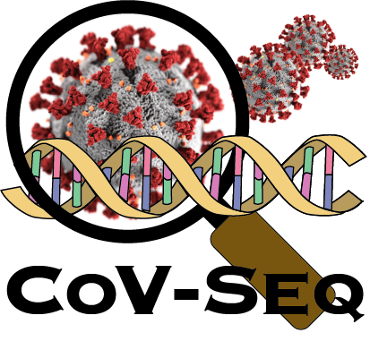

# CoV-Seq: COVID-19 Genomic Sequence Database and Visualization

Notes for Windows OS:

## Clone the repository
`git clone https://github.com/boxiangliu/covseq.git`

Git may automatically download and convert unix-format (EOL: `\n`) files in this repo into windows-format files (EOL: `\r\n`). To avoid it, the following command is needed before "git clone": 

`git config --global core.autocrlf false`

## Install Cygwin
 
Download Cygwin from [here](https://cygwin.com/install.htmladd) and add Cygwin (usually "C:\cygwin64\bin\") into Windows Enviroment Variables PATH. And you may check its success by typing "bash" in a Windows CMD Prompt.

## Install bcftools and htslib 
Download both tools from [here](http://www.htslib.org/download/)

First please install gcc (or g++) and the following dependencies from Cygwin:

BCFtools and HTSlib depend on the following libraries:

  `BCFtools`:
  
    
    zlib       <http://zlib.net> (---Cygwin package: zlib-devel 1.2.11-1)
    gsl        <https://www.gnu.org/software/gsl/> (---Cygwin package: gsl 2.3-2)
               (optional, for the 'polysomy' command)
    libperl    <http://www.perl.org/> (---Cygwin package: no need to install)
               (optional, to support filters using perl syntax)
  
  `HTSlib`:
  
    zlib       <http://zlib.net> (---Cygwin package: zlib-devel 1.2.11-1)
    libbz2     <http://bzip.org/> (---Cygwin package: libbz2-devel 1.0.8-1) 
    liblzma    <http://tukaani.org/xz/> (---Cygwin package: liblzma-devel 5.2.4-1)
    libcurl    <https://curl.haxx.se/> (---Cygwin package: libcurl-devel 7.66.0-1)
               (optional but strongly recommended, for network access)
    libcrypto  <https://www.openssl.org/> (---Cygwin package: no need to install)
               (optional, for Amazon S3 support; not needed on MacOS)
  
Please refer to the file INSTALL in bcftools.x and htslib.x for more details.

Then add the bcftools and htslib bin path into Windows Enviroment Variables PATH.

## Install Java: 
Download jdk-14.0.1_windows-x64_bin.zip from [here](https://www.oracle.com/java/technologies/javase-jdk14-downloads.html) and add into PATH.

## Install MAFFT:
Install [MAFFT](https://mafft.cbrc.jp/alignment/software/windows.html) and add into PATH.