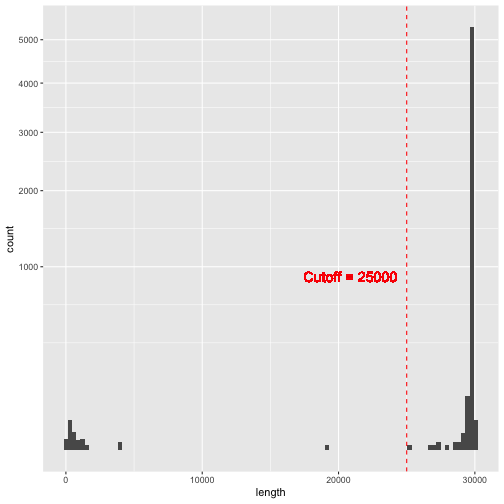
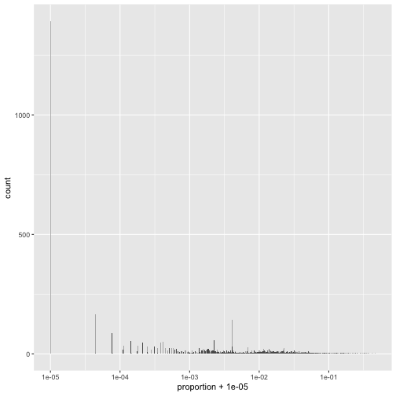
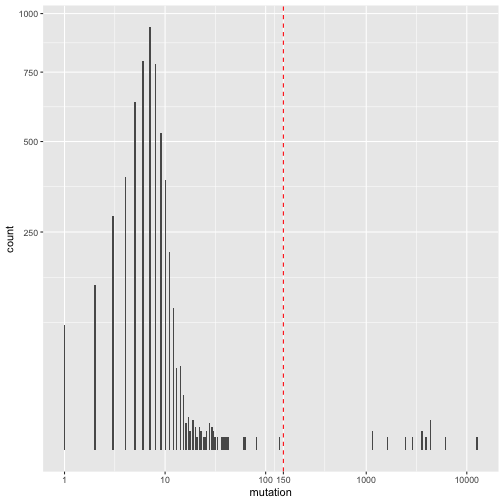

Covseq is a curated database of COVID-19 genomic sequence variants. Sequences are collected from four major repositories: [GISAID](https://www.gisaid.org/), [NCBI genbank](https://www.ncbi.nlm.nih.gov/genbank/sars-cov-2-seqs/), [EMBL](https://www.ebi.ac.uk/ena/pathogens/covid-19) and [CNGB](https://db.cngb.org/virus/ncov). Covseq hosts a growing list of non-redundant sequences (X sequences as of 15 April, 2020). Covseq also hosts a manually curated list of functional variants of COVID-19. You can download these data here. 

Covseq also integrated an interactive portal to upload COVID-19 sequences for visualization and analysis. Once you upload one or more custom sequences, Covseq will analyze the sequence and present results about genes and mutations. You will be able to explore the viral genome via a browser track and download VCF files and open reading frame predictions. 


## 


```
## Error in loadNamespace(name): there is no package called 'webshot'
```


```
## Error in loadNamespace(name): there is no package called 'webshot'
```
<button type="button" class="btn btn-link">Link</button>

## Download Lastest Dataset
You can download COVID-19 genomic variant in VCF format [here](https://drive.google.com/drive/folders/1_mivRZxjO3Dhfr3mKi4Sa7VcuV42cyav?usp=sharing). 

Two VCF files exists in this folder: 

1. merged.vcf.gz 

This file contains all sites across all virus samples. Details of our analysis pipeline can be found [here](#test). 

2. filtered.vcf.gz 

Based on merged.vcf.gz, we removed samples with an excessive number of mutations, loci with more than 2 alleles, and loci within the poly-A tail. 


## Analysis Pipeline {#pipeline}


## Functional Variants


## Additional Information


```r
in_fn = "../../processed_data/preprocess/filter_fasta/duplicated.tsv"
duplicated = fread(in_fn, sep="\t")
sum(duplicated$duplicated == 1)
```

```
## [1] 1480
```


```r
in_fn = "../../processed_data/preprocess/filter_fasta/genome_lengths.tsv"
genome_lengths = fread(in_fn, sep="\t", col.names = c("description", "length"))
p = ggplot(genome_lengths, aes(x=length)) + geom_histogram(bins=100) + scale_y_sqrt() + geom_vline(xintercept = 25000, color="red", linetype="dashed") + geom_text(x = 25000, y = 30, label = "Cutoff = 25000", color="red", hjust=1.1, size = 5)
print(p)
```




```r
in_fn = "../../processed_data/preprocess/filter_fasta/ambiguous_bases.tsv"
ambiguous_bases = fread(in_fn, sep="\t", col.names = c("description", "count", "length", "proportion"))
p = ggplot(ambiguous_bases, aes(x=proportion + 1e-5)) + geom_histogram(bins=1000) + scale_x_log10()
print(p)
```




```r
in_fn = "../../processed_data/vcf/filter_samples/mutation_count.tsv"
mutation_count = fread(in_fn, sep="\t", col.names=c("sample", "mutation"))
p = ggplot(mutation_count, aes(x=mutation)) + geom_histogram(bins=300) + scale_y_sqrt() + scale_x_log10(breaks=c(1,10,100,150,1000,10000)) + geom_vline(xintercept=150, color="red", linetype="dashed")
print(p)
```

```
## Warning: Transformation introduced infinite values in continuous x-axis
```

```
## Warning: Removed 17 rows containing non-finite values (stat_bin).
```




